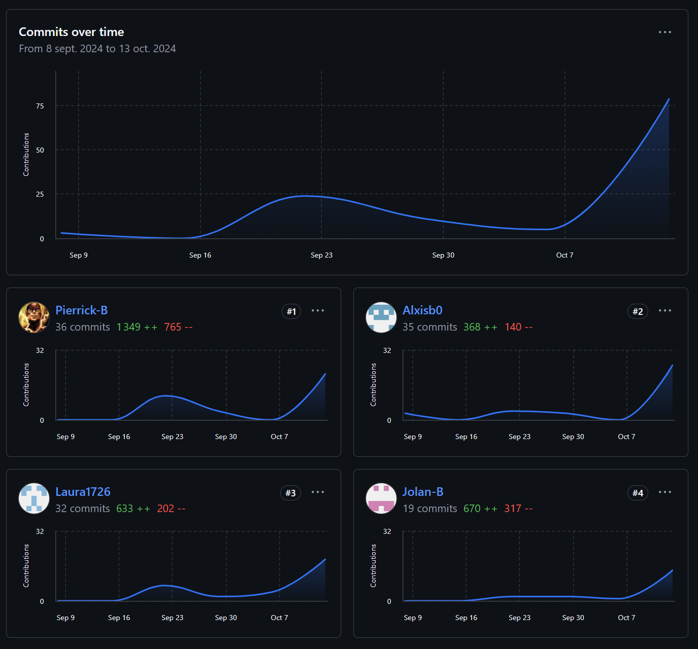

# Site d'informations sur Thales Services Numériques   

## SAE S1 05-06

[Site web SAE_05-06](https://laura1726.github.io/SAE/)

## Membres du groupe :

Etudiant 1 (référent du groupe) :  [Pierrick BAPICOT](mailto:pierrick.bapicot@edu.univ-fcomte.fr?subject=SAE_1_05_06)  
Etudiant 2 : [Alexis BOLLENGIER](mailto:alexis.bollengier@edu.univ-fcomte.fr?subject=SAE_1_05_06)   
Etudiant 3 : [Jolan BERTIN](mailto:jolan.bertin@edu.univ-fcomte.fr?subject=SAE_1_05_06)  
Etudiant 4 : [Laura BORNERT](mailto:laura.bornert@edu.univ-fcomte.fr?subject=SAE_1_05_06)   

# Présentation du projet

Ce dépôt correspond à un site web créé en HTML/CSS/JS dans le cadre de la SAÉ 05-06 à l'IUT de Belfort-Montbéliard. Ce site présente des informations concernant l'entreprise Thales Services Numériques et sert de vitrine pour présenter l'entreprise, ses activité, son organisation et son historique. Vous trouverez dans ce dépôt et sur le site un rapport économique analysant l'aspect économique de Thales Services Numériques.

## Choix de conception  

Pour la conception du site, nous nous sommes inspirés du site officiel de ***Thales**** (disponible [ici](https://www.thalesgroup.com/fr)), du site de  [Asics](https://www.asics.com/fr/fr-fr/). Nous n'avons pas repris exactement les mêmes design, mais nous nous en sommes inspiré.  

## Développement Site Web et Validation des pages

### Page d'accueil

**Auteur : Bollengier Alexis**  

Vérification W3C : [Détail ICI](https://validator.w3.org/nu/?doc=https%3A%2F%2Flaura1726.github.io%2FSAE%2F)

### Page Histoire & Engagements (Présentation)

**Auteur : BAPICOT Pierrick**  

Verification W3C : [Détail ICI](https://validator.w3.org/nu/?doc=https%3A%2F%2Flaura1726.github.io%2FSAE%2Fhistoire.html)

 

 

### Page Projets Futurs

**Auteur : Bornert Laura**  

Verification W3C : [Détail ICI](https://validator.w3.org/nu/?doc=https%3A%2F%2Flaura1726.github.io%2FSAE%2FProjetsFuturs.html)

 

 

### Page Economie (Quelques Chiffres)

**Auteur : Bertin Jolan**  

Verification W3C : [Détail ICI](https://validator.w3.org/nu/?doc=https%3A%2F%2Flaura1726.github.io%2FSAE%2FEconomie.html)

 

 

## Répartition du travail

### Planification - Diagramme de GANTT

- Bollengier Alexis
- Bertin Jolan

### Recherches d'informations

- Bapicot Pierrick
- Bornert Laura
- Bertin Jolan
- Bollengier Alexis

### Rapport économique

- Bollengier Alexis
- Bapicot Pierrick
- Bornert Laura
- Bertin Jolan

### Développement site

- Bollengier Alexis
  - Page d’accueil
- Bapicot Pierrick
  - Page histoire & engagements (Présentation)
  - Coordination des pages
  - Finitions globales
  - Déploiement sur GitLab
  - Déploiement sur BitBucket
- Bornert Laura
  - Page Projets Futurs
- Bertin Jolan
  - Page Economie
  - NavBar + footer
  - création du modèle html et css des pages (autre que la page d'accueil)

## Contributeurs

